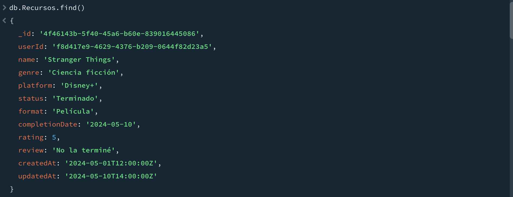
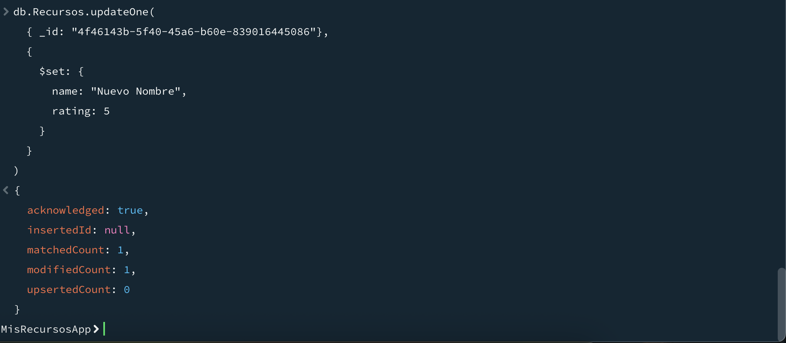
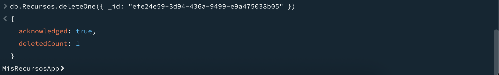
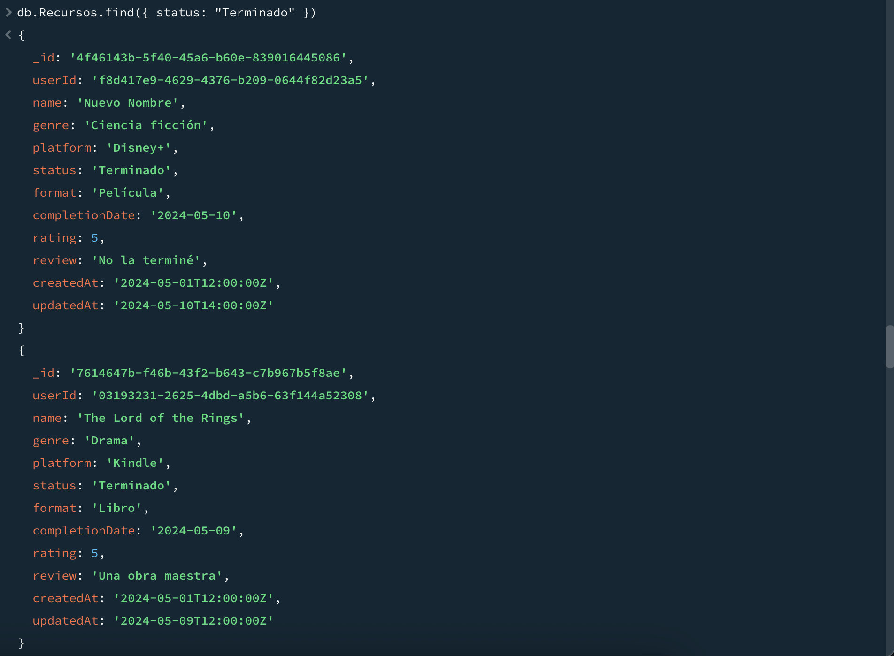
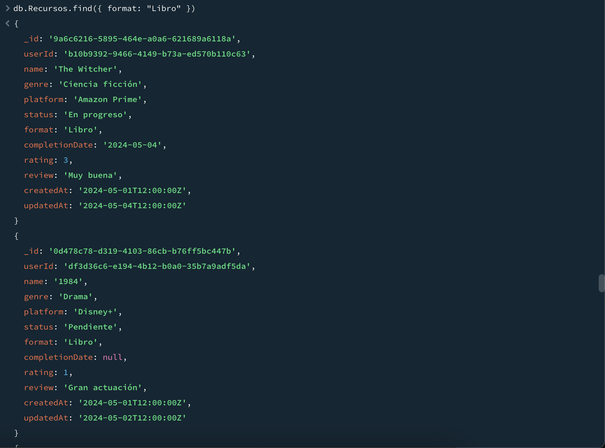
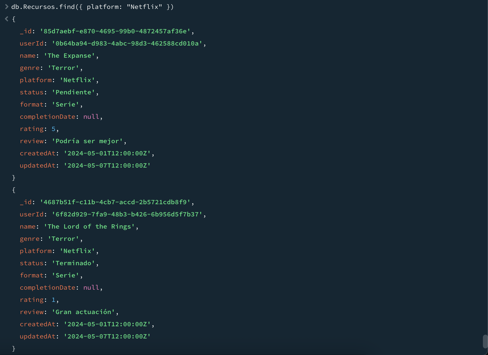
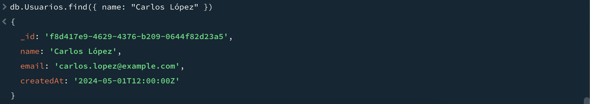

# Mis-recursos-app__HelyDiaz

# 📚 Mis Recursos App

Aplicación web que permite a los usuarios llevar un registro de su progreso al ver **series**, **películas** y **leer libros**. Los usuarios pueden añadir, modificar, eliminar y visualizar recursos, filtrarlos por estado, formato o plataforma, y buscar por nombre.

---

## 🗃️ Estructura del Proyecto

Este repositorio contiene:

- `Usuarios.json`: colección de usuarios registrados (más de 50 registros).
- `Recursos.json`: colección de recursos añadidos por los usuarios (más de 50 registros).
- Consultas CRUD, filtros y búsqueda para MongoDB Compass Shell.
- Comandos para crear base de datos y colecciones en MongoDB.

---

## 🏗️ Creación de la Base de Datos y Colecciones

### Usando MongoDB Compass o shell:

```js
use mis_recursos_app

db.createCollection("Usuarios")
db.createCollection("Recursos")
```

### Importación de datos

1. En MongoDB Compass, entra en cada colección (`Usuarios` y `Recursos`).
2. Haz clic en **"Import Data"**.
3. Selecciona el archivo correspondiente:
   - `Usuarios.json` para la colección de usuarios.
   - `Recursos.json` para la colección de recursos.

---

## ✅ Funcionalidades Requeridas

### 🔹 CRUD (Crear, Leer, Actualizar, Eliminar)

#### 🟢 Crear un recurso

```js
db.Recursos.insertOne({
  userId: "ID_DEL_USUARIO",
  name: "The Witcher",
  genre: "Fantasía",
  platform: "Netflix",
  status: "Terminado",
  format: "Serie",
  completionDate: "2024-05-15",
  rating: 4,
  review: "Muy buena serie",
  createdAt: new Date(),
  updatedAt: new Date()
})
```

---

#### 📄 Leer todos los recursos

```js
db.Recursos.find()
```


---

#### ✏️ Actualizar un recurso

```js
db.Recursos.updateOne(
  { _id: "ID_DEL_RECURSO" },
  {
    $set: {
      name: "Nuevo nombre",
      rating: 5,
    }
  }
)
```



---

#### ❌ Eliminar un recurso

```js
db.Recursos.deleteOne({ _id: "ID_DEL_RECURSO" })
```


---

## 🔍 Filtros y Búsqueda

#### 📌 Filtrar por estado

```js
db.Recursos.find({ status: "Terminado" })
// Otras opciones: "En progreso", "Pendiente"
```


---

#### 📘 Filtrar por formato

```js
db.Recursos.find({ format: "Libro" })
// Otras opciones: "Serie", "Película"
```


---

#### 📺 Filtrar por plataforma

```js
db.Recursos.find({ platform: "Netflix" })
// Otras opciones: "Amazon Prime", "Disney+", etc.
```


---

#### 🔎 Buscar por nombre (no sensible a mayúsculas)

```js
db.Recursos.find({ name: "Nombre A Buscar" })
```


---

## 📂 Archivos Incluidos

| Archivo         | Descripción                             |
|----------------|-----------------------------------------|
| `Usuarios.json`    | Contiene la colección de usuarios       |
| `Recursos.json`| Contiene la colección de recursos       |

Ambos archivos tienen más de 50 registros como se requiere.

---
